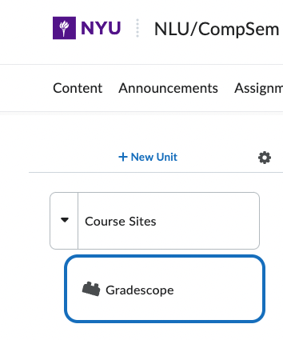

# HW 0 Instructions
** Due: February 1, 9:30 AM **

We will be using the following platforms for this course.
* [Course Syllabus](https://nyu-dsga1012-s23.github.io/syllabus/): Course information
* [Brightspace](https://brightspace.nyu.edu): Gradebook, email announcements (we will not use it very much)
* [Gradescope](https://www.gradescope.com): Assignment submission and grading
* [Campuswire](https://campuswire.com/c/GB6E76357): Discussion forum, messaging system
* [GitHub](https://github.com/NYU-DSGA1012-S23): Assignment instructions and solutions

In this assignment, you will sign up for Campuswire, Gradescope, and GitHub. All enrolled students have already been automatically signed up for Brightspace. Please make sure you complete this assigment as quickly as possible. **Future homework assignments may not be visible until after you have completed this assignment.**

## Instructions

Please follow these instructions to sign up for all course websites.

### Gradescope

You can access Gradescope through Brightspace by clicking "Content" in the navigation bar, then clicking "Course Sites" in the sidebar, then clicking "Gradescope" in the sidebar. Gradescope will then open in an embedded frame, and you will be automatically logged in. 

If you don't want to access Gradescope inside of a Brightspace frame, you can simply go to [https://www.gradescope.com/](https://www.gradescope.com/) and log in with your NYU email address. You may need to click "Forgot your password?" in order to set a password. See the [Brightspace documentation](https://help.gradescope.com/article/ki7xxn6hox-brightspace-student) for details.

### Campuswire

To sign up for Campuswire, please either click the link in the invitation email sent to your NYU address, or go directly to the Campuswire page at [https://campuswire.com/p/GB6E76357](https://campuswire.com/p/GB6E76357) and enter the invite code 8042.

### GitHub

Please create a GitHub account if you don't have one already, or if you don't want to use your existing account for the course.

## Submission

Please submit your assignment by filling out the [Google Form](https://forms.gle/riSd7s3td4box8C57) below (or at [https://forms.gle/riSd7s3td4box8C57](https://forms.gle/riSd7s3td4box8C57) if it doesn't load).

<iframe src="https://docs.google.com/forms/d/e/1FAIpQLSeezV7ZB-0KXLo60-zf0YZ0poTOpE1bxXrRq_3X_GmEgs0I3A/viewform?embedded=true" width="640" height="687" frameborder="0" marginheight="0" marginwidth="0">Loading…</iframe>

